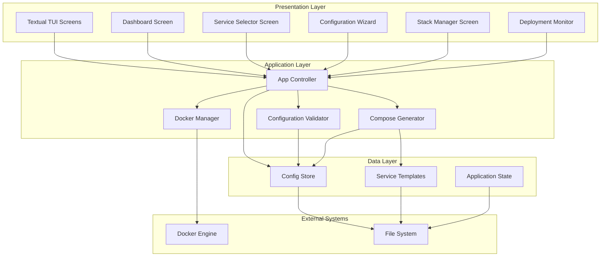
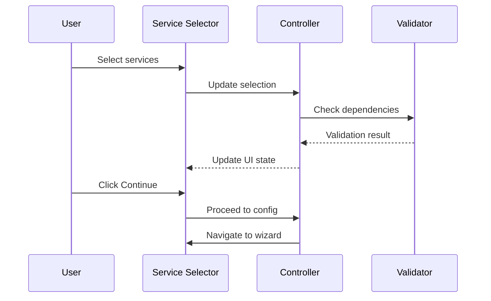
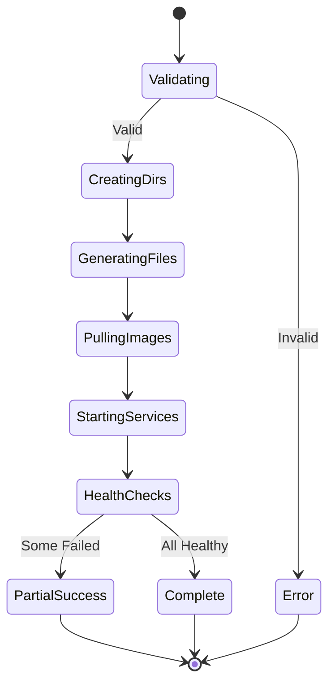

# Design Document: \*arr Stack Manager

## Overview

The \*arr Stack Manager is a Python-based Terminal User Interface (TUI) application built with the Textual framework. It provides an intuitive, menu-driven interface for deploying and managing Docker-based media automation stacks following Trash-Guides best practices. The application targets headless Linux servers and emphasizes minimal dependencies, fast startup, and reliable configuration generation.

### Design Goals

1. **Simplicity**: Reduce complexity of Docker Compose configuration for \*arr services
2. **Best Practices**: Enforce Trash-Guides recommendations automatically
3. **Reliability**: Validate configurations before deployment to prevent errors
4. **Performance**: Fast startup and low resource usage for headless environments
5. **Maintainability**: Modular architecture supporting easy addition of new services

### Key Design Decisions

- **Python with uv**: Chosen for fast dependency resolution, modern tooling, and excellent Textual framework support
- **Docker Compose v2**: Native format for multi-container orchestration with wide adoption
- **Template-based generation**: Jinja2 templates for flexible, maintainable compose file generation
- **File-based persistence**: JSON configuration files for simplicity and portability
- **Reactive UI**: Textual's reactive programming model for responsive interface updates

## Architecture

### High-Level Architecture



```

### Component Responsibilities

**Presentation Layer (Textual Screens)**
- Render UI components and handle user interactions
- Display real-time status updates and validation feedback
- Navigate between different application screens
- Collect user input through forms and selection widgets

**Application Layer**
- **App Controller**: Orchestrates screen transitions and business logic flow
- **Configuration Validator**: Validates paths, ports, permissions, and service configurations
- **Compose Generator**: Generates Docker Compose YAML and .env files from templates
- **Docker Manager**: Interfaces with Docker Engine for container lifecycle operations

**Data Layer**
- **Config Store**: Persists user configurations and stack definitions
- **Service Templates**: Jinja2 templates for each supported service
- **Application State**: Runtime state management for UI reactivity

## TUI Wireframe Designs

### 1. Main Dashboard Screen

```

┌─ \*arr Stack Manager ─────────────────────────────────────────────────────┐
│ │
│ Stack Status: ● Running (7/8 services) [Refresh] [?] │
│ │
│ ┌─ Services ──────────────────────────────────────────────────────────┐ │
│ │ │ │
│ │ ● Sonarr Running CPU: 2% MEM: 145MB [Logs] [⚙] │ │
│ │ ● Radarr Running CPU: 1% MEM: 132MB [Logs] [⚙] │ │
│ │ ● Prowlarr Running CPU: 1% MEM: 98MB [Logs] [⚙] │ │
│ │ ○ Jellyfin Stopped CPU: - MEM: - [Logs] [⚙] │ │
│ │ ● Jellyseerr Running CPU: 3% MEM: 156MB [Logs] [⚙] │ │
│ │ ● Bazarr Running CPU: 1% MEM: 87MB [Logs] [⚙] │ │
│ │ ● Recyclarr Running CPU: 0% MEM: 45MB [Logs] [⚙] │ │
│ │ ● Tdarr Running CPU: 15% MEM: 512MB [Logs] [⚙] │ │
│ │ │ │
│ └─────────────────────────────────────────────────────────────────────┘ │
│ │
│ ┌─ Quick Actions ─────────────────────────────────────────────────────┐ │
│ │ │ │
│ │ [Start All] [Stop All] [Restart All] [Update All] [Add Service] │ │
│ │ │ │
│ └─────────────────────────────────────────────────────────────────────┘ │
│ │
│ Recent Activity: │
│ • 14:32 - Sonarr: Episode downloaded │
│ • 14:15 - Radarr: Movie added to queue │
│ • 13:58 - Prowlarr: Indexer sync completed │
│ │
│ [Q]uit [S]ervices [C]onfig [H]elp │
└───────────────────────────────────────────────────────────────────────────┘

```

```

### 2. Service Selector Screen

```
┌─ Service Selection ──────────────────────────────────────────────────────┐
│                                                                          │
│  Select the services you want to include in your stack:                  │
│                                                                          │
│  ┌─ Media Management ──────────────────────────────────────────────────┐ │
│  │                                                                     │ │
│  │  [✓] Sonarr          TV show automation and management              │ │
│  │  [✓] Radarr          Movie automation and management                │ │
│  │  [✓] Prowlarr        Indexer manager for *arr apps                  │ │
│  │  [ ] Bazarr          Subtitle management                            │ │
│  │  [ ] Recyclarr       TRaSH-Guides sync automation                   │ │
│  │                                                                     │ │
│  └─────────────────────────────────────────────────────────────────────┘ │
│                                                                          │
│  ┌─ Media Servers ─────────────────────────────────────────────────────┐ │
│  │                                                                     │ │
│  │  [✓] Jellyfin        Open-source media server                       │ │
│  │  [ ] Emby            Media server (proprietary)                     │ │
│  │  [ ] Plex            Media server (requires account)                │ │
│  │                                                                     │ │
│  └─────────────────────────────────────────────────────────────────────┘ │
│                                                                          │
│  ┌─ Request Management ────────────────────────────────────────────────┐ │
│  │                                                                     │ │
│  │  [✓] Jellyseerr      Request management for Jellyfin                │ │
│  │  [ ] Overseerr       Request management for Plex                    │ │
│  │                                                                     │ │
│  └─────────────────────────────────────────────────────────────────────┘ │
│                                                                          │
│  ┌─ Download Clients & Indexers ───────────────────────────────────────┐ │
│  │                                                                     │ │
│  │  [ ] Jackett         Indexer proxy (legacy)                         │ │
│  │  [ ] Autobrr         Torrent automation                             │ │
│  │                                                                     │ │
│  └─────────────────────────────────────────────────────────────────────┘ │
│                                                                          │
│  ┌─ Media Processing ──────────────────────────────────────────────────┐ │
│  │                                                                     │ │
│  │  [ ] Tdarr           Transcoding automation                         │ │
│  │  [ ] Unpackerr       Archive extraction                             │ │
│  │                                                                     │ │
│  └─────────────────────────────────────────────────────────────────────┘ │
│                                                                          │
│  Selected: 5 services                                                    │
│                                                                          │
│  [Back]                                            [Continue →]          │
└──────────────────────────────────────────────────────────────────────────┘
```

### 3. Configuration Wizard Screen

```
┌─ Configuration Wizard ───────────────────────────────────────────────────┐
│                                                                            │
│  Step 2 of 4: Base Configuration                                          │
│  ━━━━━━━━━━━━━━━━━━━━━━━━━━━━━━━━━━━━━━━━━━━━━━━━━━━━━━━━━━━━━━━━━━━━━━  │
│                                                                            │
│  ┌─ User & Permissions ─────────────────────────────────────────────────┐ │
│  │                                                                       │ │
│  │  PUID (User ID):        [1000                    ]                   │ │
│  │  PGID (Group ID):       [1000                    ]                   │ │
│  │                                                                       │ │
│  │  ℹ Current user: media (1000:1000)                                   │ │
│  │                                                                       │ │
│  └───────────────────────────────────────────────────────────────────────┘ │
│                                                                            │
│  ┌─ Timezone ───────────────────────────────────────────────────────────┐ │
│  │                                                                       │ │
│  │  Timezone:              [America/New_York        ] [Detect]          │ │
│  │                                                                       │ │
│  │  ℹ Detected: America/New_York (EST/EDT)                              │ │
│  │                                                                       │ │
│  └───────────────────────────────────────────────────────────────────────┘ │
│                                                                            │
│  ┌─ Directory Structure ────────────────────────────────────────────────┐ │
│  │                                                                       │ │
│  │  Base Path:             [/mnt/storage            ] [Browse]          │ │
│  │                                                                       │ │
│  │  Generated Structure:                                                │ │
│  │  /mnt/storage/                                                       │ │
│  │  ├── config/          (Application configurations)                  │ │
│  │  │   ├── sonarr/                                                     │ │
│  │  │   ├── radarr/                                                     │ │
│  │  │   └── ...                                                         │ │
│  │  └── data/            (Media and downloads)                         │ │
│  │      ├── media/       (Final media location)                        │ │
│  │      │   ├── tv/                                                     │ │
│  │      │   └── movies/                                                 │ │
│  │      └── downloads/   (Download client output)                      │ │
│  │                                                                       │ │
│  │  ✓ Path exists and is writable                                       │ │
│  │                                                                       │ │
│  └───────────────────────────────────────────────────────────────────────┘ │
│                                                                            │
│  [← Back]                                              [Continue →]       │
└────────────────────────────────────────────────────────────────────────────┘
```

### 4. Stack Management Screen

```
┌─ Stack Management ───────────────────────────────────────────────────────┐
│                                                                            │
│  Service: Sonarr                                                           │
│                                                                            │
│  ┌─ Service Details ────────────────────────────────────────────────────┐ │
│  │                                                                       │ │
│  │  Status:        ● Running                                            │ │
│  │  Container:     sonarr                                               │ │
│  │  Image:         lscr.io/linuxserver/sonarr:latest                    │ │
│  │  Uptime:        2d 14h 32m                                           │ │
│  │  Web UI:        http://localhost:8989                                │ │
│  │                                                                       │ │
│  │  Resources:                                                          │ │
│  │  CPU:           2.3%  ▂▃▂▄▃▂▁▂                                       │ │
│  │  Memory:        145MB / 512MB  ████████░░░░░░░░ 28%                  │ │
│  │                                                                       │ │
│  │  Volumes:                                                            │ │
│  │  • /mnt/storage/config/sonarr → /config                             │ │
│  │  • /mnt/storage/data → /data                                        │ │
│  │                                                                       │ │
│  │  Ports:                                                              │ │
│  │  • 8989:8989                                                         │ │
│  │                                                                       │ │
│  └───────────────────────────────────────────────────────────────────────┘ │
│                                                                            │
│  ┌─ Actions ────────────────────────────────────────────────────────────┐ │
│  │                                                                       │ │
│  │  [Stop]  [Restart]  [Update]  [View Logs]  [Edit Config]  [Remove]  │ │
│  │                                                                       │ │
│  └───────────────────────────────────────────────────────────────────────┘ │
│                                                                            │
│  ┌─ Recent Logs ────────────────────────────────────────────────────────┐ │
│  │                                                                       │ │
│  │  [INFO] 14:32:15 - Episode downloaded: Show.S01E05.mkv               │ │
│  │  [INFO] 14:30:42 - Import completed successfully                     │ │
│  │  [INFO] 14:28:33 - Download started: Show.S01E05                     │ │
│  │  [INFO] 14:15:20 - RSS sync completed                                │ │
│  │  [INFO] 14:00:01 - Scheduled task: Refresh Series                    │ │
│  │                                                                       │ │
│  │                                                    [View Full Logs]   │ │
│  └───────────────────────────────────────────────────────────────────────┘ │
│                                                                            │
│  [← Back to Dashboard]                                                     │
└────────────────────────────────────────────────────────────────────────────┘
```

### 5. Deployment Monitor Screen

```
┌─ Deployment Monitor ─────────────────────────────────────────────────────┐
│                                                                            │
│  Deploying Stack: media-automation                                         │
│                                                                            │
│  ┌─ Progress ───────────────────────────────────────────────────────────┐ │
│  │                                                                       │ │
│  │  [✓] Validating configuration                                        │ │
│  │  [✓] Creating directories                                            │ │
│  │  [✓] Generating docker-compose.yml                                   │ │
│  │  [✓] Generating .env file                                            │ │
│  │  [⟳] Pulling container images                                        │ │
│  │  [ ] Starting services                                               │ │
│  │  [ ] Health checks                                                   │ │
│  │                                                                       │ │
│  │  Overall Progress: ████████████░░░░░░░░ 60%                          │ │
│  │                                                                       │ │
│  └───────────────────────────────────────────────────────────────────────┘ │
│                                                                            │
│  ┌─ Docker Output ──────────────────────────────────────────────────────┐ │
│  │                                                                       │ │
│  │  Pulling sonarr (lscr.io/linuxserver/sonarr:latest)...               │ │
│  │  latest: Pulling from linuxserver/sonarr                             │ │
│  │  a1d0c7532777: Pull complete                                         │ │
│  │  b3e8d1e4e5f2: Pull complete                                         │ │
│  │  c4f9a2d3e6a1: Downloading [=========>          ] 45.2MB/98.5MB     │ │
│  │  d5e8f3a4b2c1: Waiting                                               │ │
│  │                                                                       │ │
│  │  Pulling radarr (lscr.io/linuxserver/radarr:latest)...               │ │
│  │  latest: Pulling from linuxserver/radarr                             │ │
│  │  a1d0c7532777: Already exists                                        │ │
│  │  b3e8d1e4e5f2: Already exists                                        │ │
│  │  e2f4a5b6c3d2: Downloading [=====>              ] 28.1MB/87.3MB     │ │
│  │                                                                       │ │
│  │  ▼                                                                    │ │
│  └───────────────────────────────────────────────────────────────────────┘ │
│                                                                            │
│  Elapsed: 00:02:34                                                         │
│                                                                            │
│  [Cancel]                                                                  │
└────────────────────────────────────────────────────────────────────────────┘
```

## Components and Interfaces

### Core Components

#### 1. App Controller

**Responsibilities:**

- Application lifecycle management
- Screen navigation and state management
- Coordination between UI and business logic layers

**Interface:**

```python
class AppController:
    def initialize() -> None
    def navigate_to(screen: ScreenType) -> None
    def load_configuration() -> Configuration
    def save_configuration(config: Configuration) -> None
    def get_stack_status() -> StackStatus
```

#### 2. Configuration Validator

**Responsibilities:**

- Validate user inputs (paths, ports, permissions)
- Check Docker availability and version
- Verify service-specific requirements

**Interface:**

```python
class ConfigurationValidator:
    def validate_paths(paths: PathConfig) -> ValidationResult
    def validate_ports(ports: List[int]) -> ValidationResult
    def validate_permissions(puid: int, pgid: int) -> ValidationResult
    def validate_docker() -> ValidationResult
    def validate_service_config(service: str, config: dict) -> ValidationResult
    def validate_complete_stack(stack: StackConfig) -> ValidationResult
```

#### 3. Compose Generator

**Responsibilities:**

- Generate Docker Compose YAML from templates
- Apply Trash-Guides best practices
- Create .env files with user variables
- Configure volume mounts for hardlinking

**Interface:**

```python
class ComposeGenerator:
    def generate_compose(stack: StackConfig) -> str
    def generate_env_file(config: Configuration) -> str
    def apply_trash_guides_settings(service: str, config: dict) -> dict
    def configure_volumes(base_path: str, service: str) -> List[VolumeMount]
    def save_to_disk(output_path: str, compose: str, env: str) -> None
```

#### 4. Docker Manager

**Responsibilities:**

- Interface with Docker Engine API
- Execute container lifecycle operations
- Stream logs and status updates
- Monitor resource usage

**Interface:**

```python
class DockerManager:
    def start_service(service: str) -> OperationResult
    def stop_service(service: str) -> OperationResult
    def restart_service(service: str) -> OperationResult
    def update_service(service: str) -> OperationResult
    def remove_service(service: str) -> OperationResult
    def get_service_status(service: str) -> ServiceStatus
    def get_service_logs(service: str, lines: int) -> List[str]
    def stream_logs(service: str) -> Iterator[str]
    def get_resource_usage(service: str) -> ResourceMetrics
    def deploy_stack(compose_path: str) -> Iterator[DeploymentEvent]
```

#### 5. Service Templates

**Responsibilities:**

- Provide Jinja2 templates for each service
- Encode Trash-Guides best practices
- Support customization through variables

**Template Structure:**

```yaml
# templates/sonarr.yml.j2
services:
  sonarr:
    image: lscr.io/linuxserver/sonarr:latest
    container_name: sonarr
    environment:
      - PUID={{ puid }}
      - PGID={{ pgid }}
      - TZ={{ timezone }}
    volumes:
      - {{ config_path }}/sonarr:/config
      - {{ data_path }}:/data
    ports:
      - {{ sonarr_port }}:8989
    restart: unless-stopped
```

#### 6. Configuration Store

**Responsibilities:**

- Persist user configurations
- Load saved stack definitions
- Manage application state

**Data Model:**

```python
@dataclass
class Configuration:
    puid: int
    pgid: int
    timezone: str
    base_path: str
    selected_services: List[str]
    service_configs: Dict[str, ServiceConfig]

@dataclass
class ServiceConfig:
    name: str
    enabled: bool
    port: int
    custom_volumes: List[VolumeMount]
    environment_vars: Dict[str, str]

@dataclass
class StackConfig:
    name: str
    configuration: Configuration
    compose_path: str
    created_at: datetime
    last_modified: datetime
```

## Data Models

### Core Data Structures

```python
from dataclasses import dataclass
from typing import List, Dict, Optional
from datetime import datetime
from enum import Enum

class ServiceStatus(Enum):
    RUNNING = "running"
    STOPPED = "stopped"
    STARTING = "starting"
    STOPPING = "stopping"
    ERROR = "error"
    UNKNOWN = "unknown"

@dataclass
class VolumeMount:
    host_path: str
    container_path: str
    read_only: bool = False

@dataclass
class PortMapping:
    host_port: int
    container_port: int
    protocol: str = "tcp"

@dataclass
class ResourceMetrics:
    cpu_percent: float
    memory_usage: int  # bytes
    memory_limit: int  # bytes
    network_rx: int    # bytes
    network_tx: int    # bytes

@dataclass
class ServiceStatus:
    name: str
    status: ServiceStatus
    container_id: Optional[str]
    image: str
    uptime: Optional[int]  # seconds
    web_ui_url: Optional[str]
    metrics: Optional[ResourceMetrics]

@dataclass
class ValidationResult:
    valid: bool
    errors: List[str]
    warnings: List[str]

@dataclass
class OperationResult:
    success: bool
    message: str
    details: Optional[str]

@dataclass
class DeploymentEvent:
    timestamp: datetime
    stage: str
    message: str
    progress: float  # 0.0 to 1.0
```

### Service Definitions

```python
SUPPORTED_SERVICES = {
    "sonarr": {
        "name": "Sonarr",
        "description": "TV show automation and management",
        "image": "lscr.io/linuxserver/sonarr:latest",
        "default_port": 8989,
        "category": "media_management",
        "required_volumes": ["/config", "/data"],
        "trash_guides_url": "https://trash-guides.info/Sonarr/"
    },
    "radarr": {
        "name": "Radarr",
        "description": "Movie automation and management",
        "image": "lscr.io/linuxserver/radarr:latest",
        "default_port": 7878,
        "category": "media_management",
        "required_volumes": ["/config", "/data"],
        "trash_guides_url": "https://trash-guides.info/Radarr/"
    },
    "prowlarr": {
        "name": "Prowlarr",
        "description": "Indexer manager for *arr apps",
        "image": "lscr.io/linuxserver/prowlarr:latest",
        "default_port": 9696,
        "category": "media_management",
        "required_volumes": ["/config"],
        "trash_guides_url": "https://trash-guides.info/Prowlarr/"
    },
    "jellyfin": {
        "name": "Jellyfin",
        "description": "Open-source media server",
        "image": "lscr.io/linuxserver/jellyfin:latest",
        "default_port": 8096,
        "category": "media_server",
        "required_volumes": ["/config", "/data/media"],
        "trash_guides_url": None
    },
    "jellyseerr": {
        "name": "Jellyseerr",
        "description": "Request management for Jellyfin",
        "image": "fallenbagel/jellyseerr:latest",
        "default_port": 5055,
        "category": "request_management",
        "required_volumes": ["/app/config"],
        "trash_guides_url": None
    },
    # Additional services follow same pattern...
}
```

## Error Handling

### Error Categories

1. **Validation Errors**: Invalid user input, missing paths, port conflicts
2. **Docker Errors**: Docker daemon unavailable, image pull failures, container start failures
3. **File System Errors**: Permission denied, disk full, path not found
4. **Network Errors**: Port already in use, network unreachable
5. **Configuration Errors**: Invalid YAML, missing required fields

### Error Handling Strategy

```python
class ErrorHandler:
    """Centralized error handling with user-friendly messages"""

    ERROR_MESSAGES = {
        "docker_unavailable": {
            "title": "Docker Not Available",
            "message": "Cannot connect to Docker daemon.",
            "remediation": [
                "Ensure Docker is installed and running",
                "Check if your user has Docker permissions",
                "Try: sudo systemctl start docker"
            ]
        },
        "path_not_writable": {
            "title": "Permission Denied",
            "message": "Cannot write to {path}",
            "remediation": [
                "Check directory permissions",
                "Ensure PUID/PGID match directory owner",
                "Try: sudo chown -R {puid}:{pgid} {path}"
            ]
        },
        "port_in_use": {
            "title": "Port Conflict",
            "message": "Port {port} is already in use",
            "remediation": [
                "Choose a different port",
                "Stop the conflicting service",
                "Check with: sudo lsof -i :{port}"
            ]
        }
    }

    @staticmethod
    def handle_error(error_type: str, **kwargs) -> ErrorDisplay:
        """Generate user-friendly error display"""
        template = ErrorHandler.ERROR_MESSAGES.get(error_type)
        if template:
            return ErrorDisplay(
                title=template["title"],
                message=template["message"].format(**kwargs),
                remediation=template["remediation"]
            )
        return ErrorDisplay(
            title="Unexpected Error",
            message=str(kwargs.get("error", "Unknown error")),
            remediation=["Check logs for details"]
        )
```

## Testing Strategy

### Unit Testing

**Scope**: Individual components in isolation
**Framework**: pytest
**Coverage Target**: 80%+

```python
# Example test structure
def test_configuration_validator_valid_paths():
    validator = ConfigurationValidator()
    result = validator.validate_paths(PathConfig(
        base_path="/tmp/test",
        config_path="/tmp/test/config",
        data_path="/tmp/test/data"
    ))
    assert result.valid is True
    assert len(result.errors) == 0

def test_compose_generator_sonarr():
    generator = ComposeGenerator()
    config = StackConfig(...)
    compose = generator.generate_compose(config)
    assert "sonarr:" in compose
    assert "PUID=" in compose
```

### Integration Testing

**Scope**: Component interactions and Docker operations
**Framework**: pytest with docker-py
**Approach**: Use test containers for validation

```python
def test_docker_manager_lifecycle():
    """Test complete service lifecycle"""
    manager = DockerManager()

    # Deploy test service
    result = manager.start_service("test-sonarr")
    assert result.success is True

    # Verify running
    status = manager.get_service_status("test-sonarr")
    assert status.status == ServiceStatus.RUNNING

    # Stop service
    result = manager.stop_service("test-sonarr")
    assert result.success is True

    # Cleanup
    manager.remove_service("test-sonarr")
```

### UI Testing

**Scope**: Textual screen interactions
**Framework**: Textual's built-in testing tools
**Approach**: Snapshot testing for UI consistency

```python
async def test_dashboard_screen():
    """Test dashboard renders correctly"""
    app = StackManagerApp()
    async with app.run_test() as pilot:
        await pilot.press("d")  # Navigate to dashboard
        assert app.screen.title == "Dashboard"
        assert "Stack Status" in app.screen.render()
```

## Technology Stack

### Core Technologies

**Python 3.11+**

- Modern async/await support
- Type hints for better IDE support
- Performance improvements

**uv Package Manager**

- Fast dependency resolution (10-100x faster than pip)
- Reproducible builds with lock files
- Built-in virtual environment management
- Single binary installation

**Textual Framework**

- Rich TUI components (tables, trees, forms)
- Reactive programming model
- CSS-like styling
- Built-in testing support
- Active development and community

**Docker SDK for Python**

- Official Docker API client
- Comprehensive container management
- Stream support for logs and events

### Supporting Libraries

```toml
[project]
name = "arr-stack-manager"
version = "0.1.0"
requires-python = ">=3.11"
dependencies = [
    "textual>=0.47.0",      # TUI framework
    "docker>=7.0.0",        # Docker API client
    "jinja2>=3.1.0",        # Template engine
    "pyyaml>=6.0.0",        # YAML parsing
    "pydantic>=2.5.0",      # Data validation
    "rich>=13.7.0",         # Terminal formatting
    "click>=8.1.0",         # CLI interface
]

[project.optional-dependencies]
dev = [
    "pytest>=7.4.0",
    "pytest-asyncio>=0.21.0",
    "pytest-cov>=4.1.0",
    "ruff>=0.1.0",          # Linting and formatting
    "mypy>=1.7.0",          # Type checking
]
```

### Why Python + uv?

**Advantages:**

- **Fast Development**: Rich ecosystem of libraries
- **Textual Framework**: Best-in-class TUI framework
- **Docker Integration**: Mature Docker SDK
- **Easy Distribution**: Single-file executables with PyInstaller
- **uv Benefits**:
  - 10-100x faster than pip for dependency resolution
  - Built-in project management (uv init, uv add, uv run)
  - Lock files for reproducible builds
  - No separate virtualenv management needed

**Trade-offs:**

- Slightly larger binary size than Go/Rust
- Requires Python runtime (mitigated by PyInstaller)
- Slower startup than compiled languages (acceptable for TUI)

## Folder Structure

### Application Source Code

```
arr-stack-manager/
├── pyproject.toml              # Project metadata and dependencies
├── uv.lock                     # Locked dependencies
├── README.md
├── LICENSE
│
├── src/
│   └── arr_stack_manager/
│       ├── __init__.py
│       ├── __main__.py         # Entry point
│       │
│       ├── app.py              # Main Textual app
│       ├── controller.py       # App controller
│       │
│       ├── screens/            # Textual screens
│       │   ├── __init__.py
│       │   ├── dashboard.py
│       │   ├── service_selector.py
│       │   ├── config_wizard.py
│       │   ├── stack_manager.py
│       │   └── deployment_monitor.py
│       │
│       ├── components/         # Reusable UI components
│       │   ├── __init__.py
│       │   ├── service_card.py
│       │   ├── log_viewer.py
│       │   └── progress_bar.py
│       │
│       ├── core/               # Business logic
│       │   ├── __init__.py
│       │   ├── validator.py
│       │   ├── generator.py
│       │   ├── docker_manager.py
│       │   └── config_store.py
│       │
│       ├── models/             # Data models
│       │   ├── __init__.py
│       │   ├── configuration.py
│       │   ├── service.py
│       │   └── stack.py
│       │
│       ├── templates/          # Jinja2 templates
│       │   ├── base.yml.j2
│       │   ├── sonarr.yml.j2
│       │   ├── radarr.yml.j2
│       │   └── ...
│       │
│       └── utils/              # Utilities
│           ├── __init__.py
│           ├── errors.py
│           └── helpers.py
│
├── tests/                      # Test suite
│   ├── __init__.py
│   ├── test_validator.py
│   ├── test_generator.py
│   ├── test_docker_manager.py
│   └── test_screens.py
│
└── docs/                       # Documentation
    ├── installation.md
    ├── usage.md
    └── development.md
```

### User Data Structure

```
~/.config/arr-stack-manager/    # User configuration directory
├── config.json                 # Application settings
├── stacks/                     # Saved stack configurations
│   ├── media-automation.json
│   └── backup-stack.json
└── logs/                       # Application logs
    └── app.log

/opt/arr-stacks/                # Generated stack outputs (configurable)
├── media-automation/
│   ├── docker-compose.yml
│   ├── .env
│   ├── config/                 # Service configurations
│   │   ├── sonarr/
│   │   ├── radarr/
│   │   └── ...
│   └── data/                   # Media and downloads
│       ├── media/
│       │   ├── tv/
│       │   └── movies/
│       └── downloads/
│           ├── complete/
│           └── incomplete/
```

### Template File Structure

```
templates/
├── base.yml.j2                 # Base compose structure
├── services/
│   ├── sonarr.yml.j2
│   ├── radarr.yml.j2
│   ├── prowlarr.yml.j2
│   ├── jellyfin.yml.j2
│   └── ...
└── snippets/
    ├── common_env.j2           # Common environment variables
    ├── volume_mounts.j2        # Standard volume configurations
    └── network.j2              # Network configuration
```

## Complete Workflow

### 1. Initial Setup and Configuration

**User Actions:**

1. Install arr-stack-manager: `uv tool install arr-stack-manager`
2. Launch application: `arr-stack-manager`
3. First-run wizard detects system configuration

**System Actions:**

1. Check Docker availability and version
2. Detect current user PUID/PGID
3. Detect system timezone
4. Create configuration directory structure
5. Display welcome screen with quick start guide

### 2. Service Selection and Customization

**User Actions:**

1. Navigate to Service Selector screen
2. Select desired services using checkboxes
3. Review service descriptions and requirements
4. Proceed to configuration

**System Actions:**

1. Display categorized service list
2. Show service dependencies (e.g., Jellyseerr requires Jellyfin)
3. Validate service compatibility
4. Calculate total resource requirements
5. Store selected services in configuration

**Workflow Diagram:**



### 3. Docker Compose Generation with Trash-Guides Compliance

**User Actions:**

1. Complete configuration wizard steps
2. Review generated configuration summary
3. Confirm and generate files

**System Actions:**

1. Validate all configuration inputs
2. Load service templates from templates/
3. Apply Trash-Guides best practices:
   - Configure hardlink-compatible volume mounts
   - Set up atomic move paths
   - Apply recommended environment variables
   - Configure proper permissions
4. Generate docker-compose.yml with proper structure:
   ```yaml
   version: "3.8"
   services:
     sonarr:
       volumes:
         - /data:/data # Single mount point for hardlinks
         - /data/media/tv:/tv
         - /data/downloads:/downloads
   ```
5. Generate .env file with user variables
6. Create directory structure
7. Save configuration to user data directory

### 4. Deployment and Validation

**User Actions:**

1. Review deployment summary
2. Initiate deployment
3. Monitor progress in real-time

**System Actions:**

1. Pre-deployment validation:
   - Verify Docker daemon is running
   - Check disk space availability
   - Verify port availability
   - Test path permissions
2. Execute deployment:
   - Pull container images (with progress)
   - Create networks
   - Start services in dependency order
   - Wait for health checks
3. Post-deployment validation:
   - Verify all containers are running
   - Check service accessibility
   - Test web UI endpoints
4. Display deployment summary with access URLs

**Deployment Flow:**



### 5. Ongoing Management

**User Actions:**

1. View dashboard for stack overview
2. Select service for detailed management
3. Execute lifecycle operations (start/stop/restart/update)
4. View logs for troubleshooting
5. Modify configuration as needed

**System Actions:**

1. Real-time status monitoring:
   - Poll Docker API every 5 seconds
   - Update dashboard with current status
   - Display resource metrics
2. Log management:
   - Stream container logs
   - Support filtering and search
   - Persist important events
3. Update management:
   - Check for image updates
   - Pull new images
   - Recreate containers with new images
   - Preserve data volumes

## Implementation Guide

### Phase 1: Project Setup and Core Infrastructure

**Tasks:**

1. Initialize project with uv
2. Set up project structure
3. Configure development tools (ruff, mypy, pytest)
4. Create base data models
5. Implement configuration store

**Deliverables:**

- Working project skeleton
- Basic data models with validation
- Configuration persistence

**Estimated Effort:** 2-3 days

### Phase 2: Docker Integration

**Tasks:**

1. Implement Docker Manager class
2. Add container lifecycle operations
3. Implement status monitoring
4. Add log streaming
5. Create resource metrics collection

**Deliverables:**

- Functional Docker API integration
- Container management capabilities
- Real-time monitoring

**Estimated Effort:** 3-4 days

### Phase 3: Configuration and Validation

**Tasks:**

1. Implement Configuration Validator
2. Add path validation
3. Add port conflict detection
4. Add permission checking
5. Create validation error handling

**Deliverables:**

- Comprehensive validation system
- User-friendly error messages
- Pre-deployment safety checks

**Estimated Effort:** 2-3 days

### Phase 4: Template System and Generation

**Tasks:**

1. Create Jinja2 template structure
2. Implement Compose Generator
3. Add service templates for all supported apps
4. Implement Trash-Guides best practices
5. Add .env file generation

**Deliverables:**

- Template-based compose generation
- Trash-Guides compliant configurations
- Support for all planned services

**Estimated Effort:** 4-5 days

### Phase 5: TUI Implementation - Core Screens

**Tasks:**

1. Set up Textual application structure
2. Implement Dashboard screen
3. Implement Service Selector screen
4. Implement Configuration Wizard screen
5. Add navigation and state management

**Deliverables:**

- Working TUI application
- Core user workflows
- Screen navigation

**Estimated Effort:** 5-6 days

### Phase 6: TUI Implementation - Management Features

**Tasks:**

1. Implement Stack Management screen
2. Implement Deployment Monitor screen
3. Add log viewer component
4. Add real-time status updates
5. Implement keyboard shortcuts

**Deliverables:**

- Complete TUI feature set
- Real-time monitoring
- Log viewing capabilities

**Estimated Effort:** 4-5 days

### Phase 7: Testing and Polish

**Tasks:**

1. Write unit tests for core components
2. Write integration tests for Docker operations
3. Write UI tests for screens
4. Add error handling and edge cases
5. Performance optimization
6. Documentation

**Deliverables:**

- 80%+ test coverage
- Comprehensive error handling
- User documentation

**Estimated Effort:** 3-4 days

### Phase 8: Packaging and Distribution

**Tasks:**

1. Configure PyInstaller for binary builds
2. Create installation scripts
3. Set up CI/CD pipeline
4. Create release packages
5. Write deployment guide

**Deliverables:**

- Standalone executables
- Installation packages
- Distribution documentation

**Estimated Effort:** 2-3 days

## Deployment Packaging Options

### Option 1: uv Tool Installation (Recommended)

**Advantages:**

- Simple installation: `uv tool install arr-stack-manager`
- Automatic dependency management
- Easy updates: `uv tool upgrade arr-stack-manager`
- Cross-platform support

**Distribution:**

```bash
# Publish to PyPI
uv build
uv publish

# Users install with:
uv tool install arr-stack-manager

# Run with:
arr-stack-manager
```

### Option 2: Standalone Binary (PyInstaller)

**Advantages:**

- No Python runtime required
- Single-file distribution
- Faster startup

**Build Process:**

```bash
# Build binary
pyinstaller --onefile \
  --name arr-stack-manager \
  --add-data "templates:templates" \
  src/arr_stack_manager/__main__.py

# Distribute binary
./dist/arr-stack-manager
```

### Option 3: Docker Container

**Advantages:**

- Isolated environment
- Consistent across systems
- Easy deployment on servers

**Dockerfile:**

```dockerfile
FROM python:3.11-slim

# Install uv
COPY --from=ghcr.io/astral-sh/uv:latest /uv /usr/local/bin/uv

# Install Docker CLI
RUN apt-get update && apt-get install -y docker.io

WORKDIR /app
COPY . .

RUN uv sync --frozen

ENTRYPOINT ["uv", "run", "arr-stack-manager"]
```

**Usage:**

```bash
docker run -it \
  -v /var/run/docker.sock:/var/run/docker.sock \
  -v ~/.config/arr-stack-manager:/root/.config/arr-stack-manager \
  arr-stack-manager
```

### Recommended Approach

**Primary**: uv tool installation for ease of use and updates
**Secondary**: Standalone binary for users without Python
**Optional**: Docker container for containerized environments

## Key Design Patterns

### 1. Repository Pattern

Used for configuration persistence and data access:

```python
class ConfigRepository:
    def __init__(self, config_dir: Path):
        self.config_dir = config_dir

    def save(self, config: Configuration) -> None:
        path = self.config_dir / "config.json"
        path.write_text(config.model_dump_json(indent=2))

    def load(self) -> Optional[Configuration]:
        path = self.config_dir / "config.json"
        if path.exists():
            return Configuration.model_validate_json(path.read_text())
        return None
```

### 2. Template Method Pattern

Used for service-specific configuration:

```python
class ServiceConfigurator(ABC):
    def configure(self, config: Configuration) -> dict:
        base_config = self._get_base_config(config)
        service_config = self._get_service_config(config)
        volumes = self._configure_volumes(config)
        return {**base_config, **service_config, "volumes": volumes}

    @abstractmethod
    def _get_service_config(self, config: Configuration) -> dict:
        pass
```

### 3. Observer Pattern

Used for real-time UI updates:

```python
class StatusMonitor:
    def __init__(self):
        self._observers: List[Callable] = []

    def subscribe(self, callback: Callable) -> None:
        self._observers.append(callback)

    def notify(self, status: ServiceStatus) -> None:
        for observer in self._observers:
            observer(status)
```

### 4. Strategy Pattern

Used for different validation strategies:

```python
class ValidationStrategy(ABC):
    @abstractmethod
    def validate(self, value: Any) -> ValidationResult:
        pass

class PathValidationStrategy(ValidationStrategy):
    def validate(self, path: str) -> ValidationResult:
        # Path-specific validation
        pass

class PortValidationStrategy(ValidationStrategy):
    def validate(self, port: int) -> ValidationResult:
        # Port-specific validation
        pass
```

## Performance Considerations

### Startup Performance

**Target**: < 3 seconds on typical hardware

**Optimizations:**

1. Lazy load service templates
2. Cache Docker API responses
3. Minimize initial file I/O
4. Use async operations for Docker calls

### Memory Usage

**Target**: < 100MB during normal operation

**Optimizations:**

1. Stream logs instead of buffering
2. Limit status history retention
3. Use generators for large data sets
4. Release Docker client connections when idle

### Responsiveness

**Target**: UI updates within 100ms

**Optimizations:**

1. Use Textual's reactive system
2. Run Docker operations in background workers
3. Update UI incrementally during long operations
4. Implement proper cancellation for user interrupts

## Security Considerations

### Docker Socket Access

- Require explicit user permission for Docker socket access
- Document security implications
- Support Docker context for remote Docker hosts
- Validate all Docker API inputs

### File System Permissions

- Validate PUID/PGID before use
- Check write permissions before creating files
- Use secure temporary directories
- Sanitize all path inputs

### Configuration Storage

- Store sensitive data in secure locations
- Use appropriate file permissions (0600 for configs)
- Support environment variable overrides
- Never log sensitive information

### Input Validation

- Validate all user inputs
- Sanitize template variables
- Prevent path traversal attacks
- Validate port ranges

## Future Enhancements

### Phase 2 Features (Post-MVP)

1. **Backup and Restore**

   - Export stack configurations
   - Backup service data
   - Restore from backup

2. **Remote Management**

   - Manage multiple Docker hosts
   - SSH tunnel support
   - Remote deployment

3. **Advanced Monitoring**

   - Prometheus metrics export
   - Alert notifications
   - Performance graphs

4. **Configuration Profiles**

   - Save multiple stack configurations
   - Quick switching between profiles
   - Template sharing

5. **Service Discovery**

   - Auto-detect running services
   - Import existing compose files
   - Migrate from manual setups

6. **Update Management**

   - Automatic update checks
   - Scheduled updates
   - Rollback capability

7. **Web UI**
   - Optional web interface
   - Remote access
   - Mobile-friendly design

## Conclusion

This design provides a comprehensive blueprint for building a production-ready \*arr Stack Manager. The architecture emphasizes:

- **Modularity**: Clear separation of concerns for maintainability
- **Reliability**: Comprehensive validation and error handling
- **Usability**: Intuitive TUI with guided workflows
- **Best Practices**: Automatic application of Trash-Guides recommendations
- **Performance**: Fast startup and low resource usage
- **Extensibility**: Easy addition of new services and features

The implementation plan breaks down the work into manageable phases, each delivering incremental value. The technology choices (Python + uv + Textual) provide the best balance of development speed, user experience, and deployment flexibility.

By following this design, the resulting application will simplify \*arr stack management while maintaining the flexibility and power that advanced users require.
