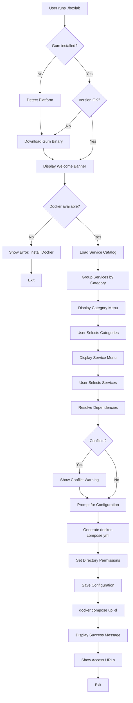
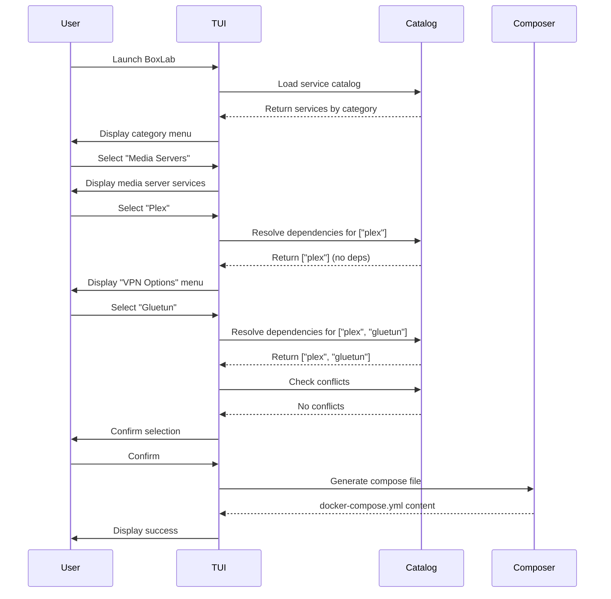
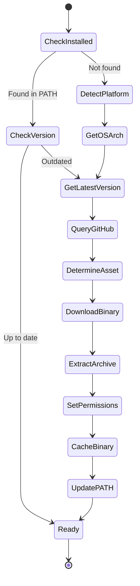
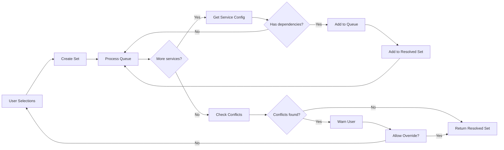
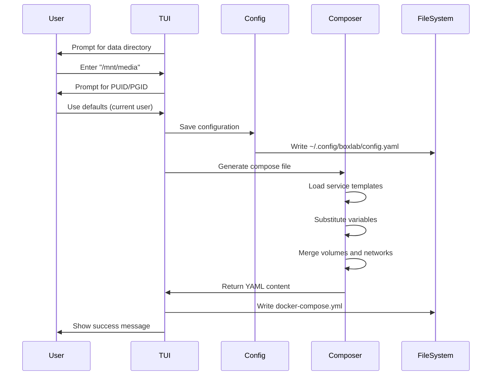
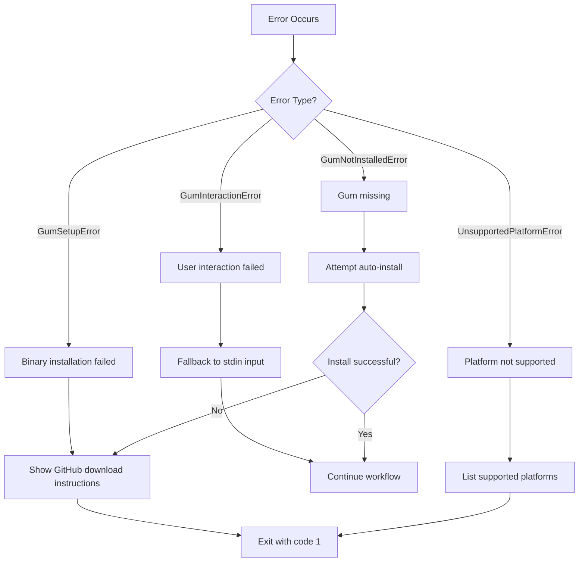
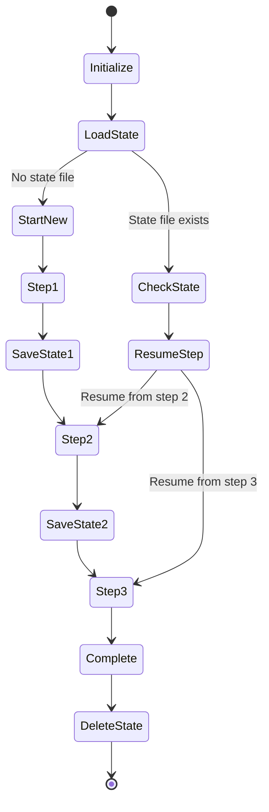

# Workflow Documentation

Step-by-step process flows for key BoxLab operations.

## Table of Contents

- [Complete Installation Workflow](#complete-installation-workflow)
- [Service Selection Workflow](#service-selection-workflow)
- [Binary Management Workflow](#binary-management-workflow)
- [Dependency Resolution Workflow](#dependency-resolution-workflow)
- [Configuration Generation Workflow](#configuration-generation-workflow)
- [Error Recovery Workflow](#error-recovery-workflow)

---

## Complete Installation Workflow

The end-to-end process from user launching BoxLab to services running.



### Step-by-Step Breakdown

#### 1. **Entry Point** (`./boxlab`)

```python
#!/usr/bin/env python3
import sys
from pathlib import Path

# Add bin/ to PATH for Gum binary
bin_dir = Path(__file__).parent / "bin"
sys.path.insert(0, str(Path(__file__).parent))

from lib.setup import ensure_gum_binary, GumSetupError
from lib.cli import run_cli

try:
    ensure_gum_binary()
except GumSetupError as e:
    print(f"Error: {e}")
    sys.exit(1)

run_cli()
```

#### 2. **Binary Setup** (`lib/setup.py`)

- Check if `gum` is in PATH
- If not found or outdated:
  - Detect OS and architecture
  - Fetch latest version from GitHub
  - Download appropriate asset
  - Extract to `~/.cache/boxlab/gum/{version}/`
  - Set executable permissions
- Return path to binary

#### 3. **CLI Workflow** (`lib/cli.py`)

- Display welcome banner with ASCII art
- Check Docker installation
- Load service catalog
- Present service selection
- Collect configuration inputs
- Resolve dependencies
- Generate compose file
- Launch services

---

## Service Selection Workflow

How users select services with dependency resolution.



### Dependency Resolution Algorithm

```python
def resolve_dependencies(selected: list[str], services: dict) -> list[str]:
    """
    Recursively resolve service dependencies.

    Args:
        selected: User-selected service names
        services: Full service catalog

    Returns:
        Complete list including all dependencies
    """
    resolved = set(selected)
    to_process = list(selected)

    while to_process:
        service = to_process.pop(0)

        if service not in services:
            raise ValueError(f"Unknown service: {service}")

        # Get dependencies
        deps = services[service].get("dependencies", [])

        for dep in deps:
            if dep not in resolved:
                resolved.add(dep)
                to_process.append(dep)

    return sorted(resolved)
```

### Example Flow

**User Input**: `["sonarr", "radarr"]`

**Resolution Process**:

1. Check `sonarr` dependencies → `["prowlarr"]`
2. Add `prowlarr` to list
3. Check `radarr` dependencies → `["prowlarr"]`
4. `prowlarr` already in list, skip
5. Check `prowlarr` dependencies → `[]`

**Final Output**: `["prowlarr", "radarr", "sonarr"]` (sorted alphabetically)

---

## Binary Management Workflow

How Gum binary is installed and managed across platforms.



### Platform Detection

```python
def get_gum_asset_name(version: str) -> str:
    """
    Determine correct asset name for current platform.

    Supported platforms:
    - linux_x86_64 → gum_{version}_Linux_x86_64.tar.gz
    - linux_arm64 → gum_{version}_Linux_arm64.tar.gz
    - darwin_x86_64 → gum_{version}_Darwin_x86_64.tar.gz
    - darwin_arm64 → gum_{version}_Darwin_arm64.tar.gz
    """
    os_type = get_os()  # "linux" or "darwin"
    arch = get_arch()  # "x86_64" or "arm64"

    os_map = {
        "linux": "Linux",
        "darwin": "Darwin"
    }

    return f"gum_{version}_{os_map[os_type]}_{arch}.tar.gz"
```

### Cache Strategy

**Directory Structure**:

```
~/.cache/boxlab/
└── gum/
    ├── 0.17.0/
    │   └── gum (executable)
    └── 0.18.0/
        └── gum (executable)
```

**Version Management**:

- Multiple versions can coexist
- Latest version used by default
- Old versions cleaned up after 30 days (TODO)

---

## Dependency Resolution Workflow

How service dependencies are resolved and validated.



### Conflict Detection

```python
def check_conflicts(services: list[str], catalog: dict) -> list[tuple[str, str]]:
    """
    Check for conflicting services.

    Args:
        services: List of selected service names
        catalog: Full service catalog

    Returns:
        List of conflict pairs [(service1, service2), ...]
    """
    conflicts = []

    for i, service1 in enumerate(services):
        config1 = catalog[service1]
        conflict_list = config1.get("conflicts", [])

        for service2 in services[i+1:]:
            if service2 in conflict_list:
                conflicts.append((service1, service2))

    return conflicts
```

### Example Conflicts

| Service A   | Service B  | Reason                          |
| ----------- | ---------- | ------------------------------- |
| Gluetun     | Windscribe | Multiple VPN providers conflict |
| Plex        | Jellyfin   | Same port (8096) by default     |
| qBittorrent | Deluge     | Same port (8080) for web UI     |

---

## Configuration Generation Workflow

How configuration is collected and docker-compose.yml is generated.



### Configuration Template

```yaml
# ~/.config/boxlab/config.yaml
version: 1

directories:
  data_dir: /mnt/media
  config_dir: /mnt/config

user:
  puid: 1000
  pgid: 1000

vpn:
  provider: pia
  username: ${VPN_USERNAME}
  password: ${VPN_PASSWORD}

services:
  - plex
  - sonarr
  - radarr
  - prowlarr
  - gluetun
```

### Compose Generation

```python
def generate_compose(services: list[str], config: dict) -> str:
    """
    Generate docker-compose.yml from templates.

    Args:
        services: List of service names
        config: User configuration

    Returns:
        Complete docker-compose.yml as string
    """
    compose = {
        "version": "3.8",
        "services": {},
        "networks": {},
        "volumes": {}
    }

    for service in services:
        template = load_service_template(service)
        compose["services"][service] = substitute_vars(template, config)

    return yaml.dump(compose)
```

---

## Error Recovery Workflow

How BoxLab handles and recovers from errors.



### Error Message Examples

#### GumSetupError

```
Error: Failed to install Gum binary

BoxLab requires Charm's Gum for interactive menus.

Attempted to:
- Download from: https://github.com/charmbracelet/gum/releases
- Install to: ~/.cache/boxlab/gum/0.17.0/

Error: HTTP 404 - Asset not found for darwin_arm64

Manual installation:
  brew install gum

Then re-run BoxLab.
```

#### GumInteractionError with Fallback

```
Warning: Gum menu failed, using text input fallback

Available services:
  1. Plex Media Server
  2. Sonarr
  3. Radarr
  4. Prowlarr

Enter numbers separated by commas (e.g., 1,2,3): _
```

### Debug Mode

Enable detailed logging:

```bash
BOXLAB_DEBUG=1 ./boxlab
```

**Debug Output**:

```
[DEBUG] Platform: darwin arm64
[DEBUG] Gum version: 0.17.0
[DEBUG] Running: gum choose --no-limit --selected=Plex Plex Sonarr Radarr
[DEBUG] Process exited with code: 0
[DEBUG] Output: Plex
Sonarr
```

---

## State Persistence Workflow

How workflow state is saved and resumed (TODO).



### State File Format

```json
{
  "version": 1,
  "workflow_id": "install_services",
  "current_step": 3,
  "total_steps": 7,
  "completed_steps": [1, 2],
  "state": {
    "selected_services": ["plex", "sonarr", "radarr"],
    "configuration": {
      "data_dir": "/mnt/media",
      "puid": 1000,
      "pgid": 1000
    }
  },
  "timestamp": "2024-01-15T10:30:00Z"
}
```

**Location**: `~/.config/boxlab/workflow-state.json`

---

**Next**: See [Architecture Decisions](./decisions/) for ADR records.
